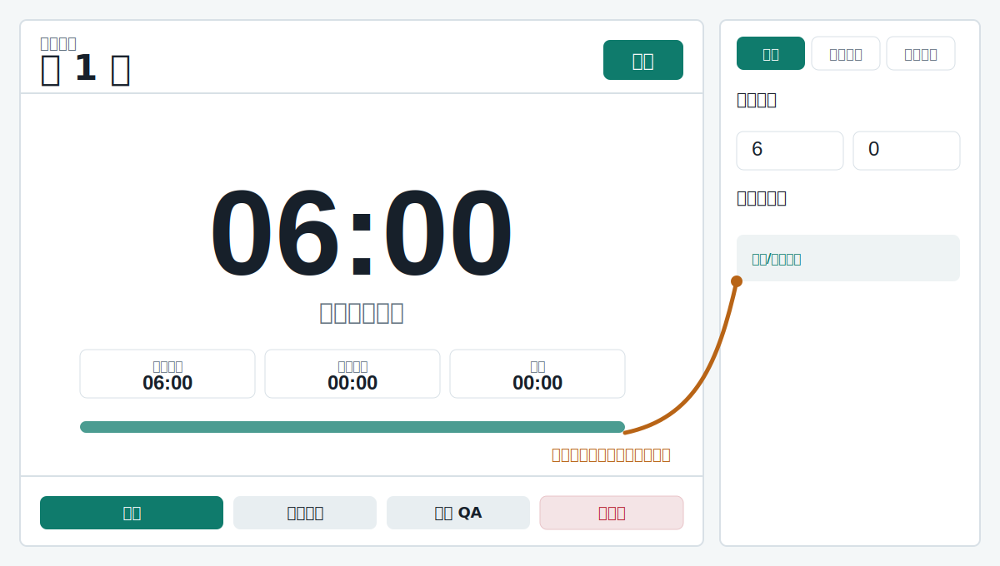
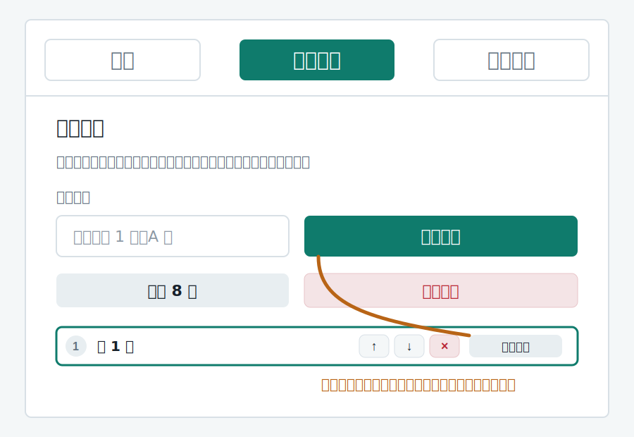
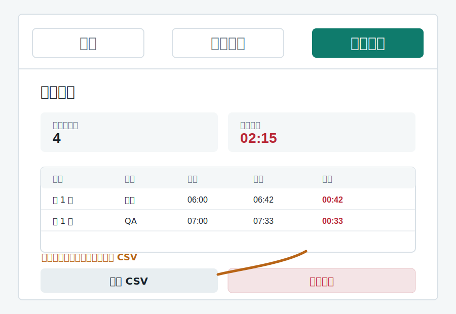

# 課程報告計時器

這是一個給多組課堂報告使用的單頁計時器。預設流程是每組 **6 分鐘報告 + 7 分鐘 QA**，在各階段剩 30 秒時響鈴一次，時間到再響鈴一次。時間到後會繼續計算超時，直到按下「暫停/結束本段」。



## 開啟方式

線上直接使用：

[https://likebearlala.github.io/Timer/](https://likebearlala.github.io/Timer/)

這個網址是 GitHub Pages 發布出來的可操作計時器頁面，不需要下載檔案。GitHub repo 頁面主要是用來查看原始碼與使用手冊。

也可以在本機直接用瀏覽器打開 `index.html`，不需要安裝套件或啟動伺服器。

本機檔案位置：

```text
C:\Users\labpc\OneDrive\文件\Timer\index.html
```

GitHub 專案：

[https://github.com/likebearlala/Timer](https://github.com/likebearlala/Timer)

## 快速使用流程

1. 打開 `index.html`。
2. 先按右側「啟用/測試鈴聲」，確認教室喇叭音量足夠。
3. 在「設定」分頁確認報告時間、QA 時間與提醒時間。
4. 到「組別順序」分頁建立或新增上台順序。
5. 回主畫面按「開始」。
6. 時間到後若仍在報告或 QA，畫面會顯示 `+00:01`、`+00:02` 來計算超時。
7. 該階段結束時按「暫停/結束本段」，資料會寫入「歷史紀錄」。
8. 按「切到 QA」或「下一組」繼續下一段。

## 主畫面說明

左側是場控時最常用的區域：

- `目前組別`：顯示正在上台的組別名稱。
- `報告 / QA`：顯示目前階段。
- 大型時間：倒數時顯示剩餘時間；超時後顯示 `+超時時間`。
- `原定時間`：本段設定的時間。
- `實際已用`：本段已經花費的時間。
- `超時`：超過原定時間的秒數。
- `開始`：開始倒數。
- `暫停/結束本段`：停止計時並記錄目前段落。
- `重設本段`：清除目前段落計時，不寫入紀錄。
- `切到 QA / 回報告`：切換報告與 QA 階段。
- `下一組`：結束目前段落並依組別順序前進。

## 設定分頁

右側「設定」分頁可調整計時規則：

- `報告分鐘 / 報告秒數`：設定報告時間，預設 6 分鐘。
- `QA 分鐘 / QA 秒數`：設定 QA 時間，預設 7 分鐘。
- `6 + 7 分鐘`：快速回到正式課程設定。
- `測試 40 + 40 秒`：快速測試半分鐘提醒與時間到鈴聲。
- `剩餘分鐘 / 剩餘秒數`：設定提前提醒時間，預設剩 30 秒。
- `報告時間到自動進入 QA`：勾選後，報告倒數到 0 會自動切到 QA；若要記錄報告超時，建議不要勾。
- `啟用/測試鈴聲`：第一次使用一定要先按，瀏覽器才會允許播放提示音。
- `鈴聲樣式`：可選清亮鐘聲、柔和木琴、教室大鈴、狗叫、叮一聲。
- `鈴聲音量`：調整網頁產生的鈴聲音量。教室音量仍需另外調整電腦或喇叭。

## 組別順序分頁

「組別順序」是後台排程功能，用來設定各組上台順序。



可用操作：

- 在 `組別名稱` 輸入組名後按「新增組別」。
- 按「建立 8 組」可快速產生第 1 組到第 8 組。
- 按 `↑`、`↓` 調整順序。
- 按 `×` 刪除該組。
- 按「設為目前」可直接跳到該組。
- 按主畫面的「下一組」會依照這份順序前進。

組別順序會儲存在同一台電腦的瀏覽器中，下次打開仍會保留。

## 歷史紀錄分頁

每次按「暫停/結束本段」、「切到 QA」或「下一組」時，只要目前段落已經計時，就會寫入歷史紀錄。



紀錄內容包含：

- 組別名稱
- 階段：報告或 QA
- 原定時間
- 實際用時
- 超時時間

其他功能：

- `已記錄段落`：目前已寫入幾筆段落紀錄。
- `累計超時`：所有紀錄的超時加總。
- `下載 CSV`：匯出成試算表可開啟的 CSV。
- `清除紀錄`：刪除本機瀏覽器中的歷史紀錄。

## 建議的課堂操作方式

正式上課前：

1. 開啟網頁並測試鈴聲。
2. 到「組別順序」建立各組順序。
3. 確認「設定」中的報告與 QA 時間。

每組上台時：

1. 確認主畫面的組別與階段。
2. 按「開始」。
3. 聽到剩 30 秒鈴聲時提醒講者收尾。
4. 時間到若仍繼續，畫面會顯示超時。
5. 講者結束後按「暫停/結束本段」。
6. 按「切到 QA」開始 QA，或按「下一組」進入下一組。

## 注意事項

- 瀏覽器通常會禁止未經點擊的自動播放聲音，所以第一次一定要按「啟用/測試鈴聲」。
- 鈴聲大小同時受網頁音量、電腦音量、喇叭音量影響。
- 歷史紀錄與組別順序存在目前瀏覽器的 `localStorage`，換電腦或換瀏覽器不會自動帶過去。
- 若要保留紀錄，請在清除前先下載 CSV。
